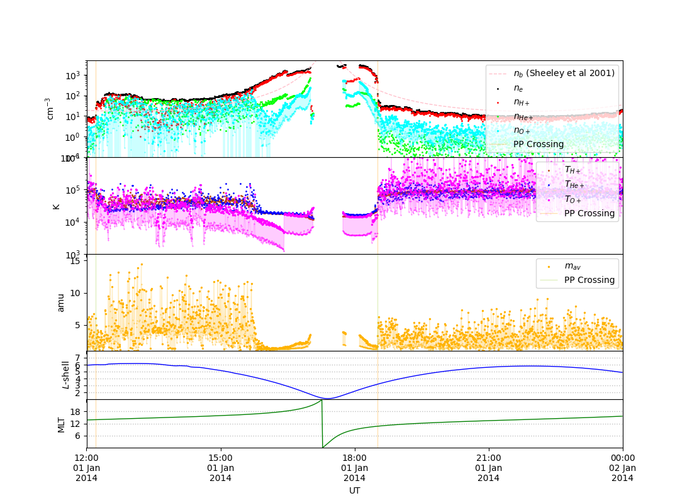

# ECT - Energetic Particle , Composition, and Thermal Plasma Suite

The overview of this instrument suite can be found in Spence et al., 2013.

ECT contains the following instruments:

- Helium, Oxygen, Proton, and Electron (HOPE) Mass
  Spectrometer (Funsten et al., 2013)

- Magnetic Electron Ion Spectrometer (MagEIS, Blake et al., 2013)

- Relativistic Electron-Proton Telescope (REPT, Baker et al., 2013)


## List of Functions

The following functions are all called from within the `ECT` submodule, e.g.: `RBSP.ECT.DownloadData()`

| Function Name           | Description                                                             | Section |
| ----------------------- | ----------------------------------------------------------------------- | ------- |
| `DownloadData()`        | Download latest data files.                                             |         |
| `ReadCDF()`             | Read a downloaded CDF file.                                             |         |
| `DataAvailability()`    | Checks what dates have data.                                            |         |
| `DeleteDate()`          | Deletes data from a specific date.                                      |         |
| `RebuildDataIndex()`    | Scan the downloaded data and rebuild the index file.                    |         |
| `ReadHOPESA()`          | Read the HOPE Spin-Averaged data into a `PSpecCls` object (see here).   |         |
| `ReadHOPEMoments()`     | Read the HOPE moments (these appear to be warm plasma moments).         |         |
| `ReadHOPEOmni()`        | Read the omnidirectional HOPE data into a `PSpecCls` object (see here). |         |
| `SaveIonMoments()`      | Save the cold ion moments.                                              |         |
| `ReadIonMoments()`      | Read the cold ion moments.                                              |         |
| `MomentAvailability()`  | Check what dates there are moments calculated for.                      |         |
| `CalculateIonMoments()` | Calculate the low energy ion moments.                                   |         |
| `PlotMoments()`         | Plot moments.                                                           |         |
| `PlotDensity()`         | Plot density.                                                           |         |
| `PlotTemp()`            | Plot the temperature.                                                   |         |
| `PlotMav()`             | Plot the average ion mass.                                              |         |

## Downloading Data

Data from HOPE, MagEIS and REPT can al be downloaded using the `DownloadData()` function. The `sc`, `Inst` and `L` keywords determine which probe (`'a'` or `'b'`), instrument or level of data to download (see table below). To limit the time period over which to download data set the `Date` keyword to a 2 element `list` (or similar) containing the start and end dates in the format yyyymmdd.

| `Inst`     | `L`                | Description |
| ---------- | ------------------ | ----------- |
| `'hope'`   | `'l2.sectors'`     |             |
| `'hope'`   | `'l2.spinaverage'` |             |
| `'hope'`   | `'l3.moments'`     |             |
| `'hope'`   | `'l3.pitchangle'`  |             |
| `'mageis'` | `'l2'`             |             |
| `'mageis'` | `'l3'`             |             |
| `'rept'`   | `'l2'`             |             |
| `'rept'`   | `'l3'`             |             |

Data are stored in `$RBSP_PATH/ECT/Inst/L/sc/` (e.g. `$RBSP_PATH/ECT/hope/l2.sectors/a/`) and the index file is named `$RBSP_PATH/ECT/Inst.L.sc.dat`which lists all of the downloaded files, their dates and their versions.

## Reading Data

All of the downloaded data can be read in directly from the CDF files using `ReadCDF()`, e.g.

```python
import RBSP

cdf,meta = RBSP.ECT.ReadCDF(20140101,sc='a',Inst='hope',L='l3.moments')
```

The first argument is the date in the format yyyymmdd and the three keywords accepted are described in the [Downloading Data](#downloading-data) section. `ReadCDF()` returns two `dict`, where `cdf` is the CDF data and `meta` is the corresponding metadata.

Some HOPE-specific functions exist:

```python
#moment data from HOPE
mom = RBSP.ECT.ReadHOPEMoments(Date,sc)

#spin averaged data
sa = RBSP.ECT.ReadHOPESA(Date,sc)

#Omnidirectional data
omni = RBSP.ECT.ReadHOPEOmni(Date,sc)
```

## HOPE Moments

The moments provided by the data repository are warm plasma moments. The functions in this sections make an attempt to calculate the cold ion moments.

Prior to calculating the cold ion moments, we need to have downloaded all of the required HOPE Omni data, calculated all of the spacecraft potentials (see EFW), ExB drifts (see VExB) and downloaded all level 4 EMFISIS data (see EMFISIS).

This function calculates all of the moments:

```python
mom = RBSP.ECT.CalculateIonMoments(Date,sc,MaxE=0.02)
```

where `MaxE` is the maximum energy bin (keV) to include in the spectral integration (usually around 0.02 keV). The moments are calculated using the method described by Goldstein et al., 2014, Genestreti et al., 2017 and Goldstein et al., 2019.

Moments are all saved to disk (`$RBSP_PATH/Moments/Ions/sc/`, where `sc` is either `a` or `b`) using `SaveIonMoments()`, e.g:

```python
RBSP.ECT.SaveIonMoments(Date,sc)
```

The moments can be read using:

```python
mom = RBSP.ECT.ReadIonMoments(Date,sc)
```


## Plotting Functions

The ion moments can be plotted using `PlotDensity()`, `PlotTemp()` and `PlotMav()`, os using    `PlotMoments()` which uses all three of the former functions together.

```python
# The PlotMoments() function returns a list of axes
axs = RBSP.ECT.PlotMoments(20140101,'a',ut=[12.0,24.0])
```

The above code should produce this plot:




## References

Baker, D.N., Kanekal, S.G., Hoxie, V.C. *et al.* The Relativistic Electron-Proton Telescope (REPT) Instrument on Board the Radiation Belt Storm Probes (RBSP) Spacecraft: Characterization of Earth’s Radiation Belt High-Energy Particle Populations. *Space Sci Rev* **179,** 337–381 (2013). https://doi.org/10.1007/s11214-012-9950-9

Blake, J.B., Carranza, P.A., Claudepierre, S.G. *et al.* The *Magnetic Electron Ion Spectrometer* (MagEIS) Instruments Aboard the Radiation Belt Storm Probes (RBSP) Spacecraft. *Space Sci Rev* **179,** 383–421 (2013). https://doi.org/10.1007/s11214-013-9991-8

Funsten, H.O., Skoug, R.M., Guthrie, A.A. *et al.* Helium, Oxygen, Proton, and Electron (HOPE) Mass Spectrometer for the Radiation Belt Storm Probes Mission. *Space Sci Rev* **179,** 423–484 (2013). https://doi.org/10.1007/s11214-013-9968-7

Genestreti, K. J., Goldstein, J., Corley, G. D., Farner, W., Kistler, L. M., Larsen, B. A., & Turner, N. E. (2017). Temperature of the plasmasphere from Van Allen probes hope. Journal of Geophysical Research: Space Physics, 122(1), 310–323. https://doi.org/10.1002/2016ja023047

Goldstein, J., Gallagher, D., Craven, P. D., Comfort, R. H., Genestreti, K. J., Mouikis, C., & De Pascuale, S. (2019). Temperature dependence of plasmaspheric ion composition. Journal of Geophysical Research: Space Physics, 124(8), 6585–6595. https://doi.org/10.1029/2019ja026822

Goldstein, J., Pascuale, S. D., Kletzing, C., Kurth, W., Genestreti, K. J., Skoug, R. M., & Spence, H. (2014). Simulation of van allen probes plasmapause encounters. Journal of Geophysical Research: Space Physics, 119(9), 7464–7484. https://doi.org/10.1002/2014ja020252

Spence, H.E., Reeves, G.D., Baker, D.N. *et al.* Science Goals and Overview of the Radiation Belt Storm Probes (RBSP) Energetic Particle, Composition, and Thermal Plasma (ECT) Suite on NASA’s Van Allen Probes Mission. *Space Sci Rev* **179,** 311–336 (2013). https://doi.org/10.1007/s11214-013-0007-5
